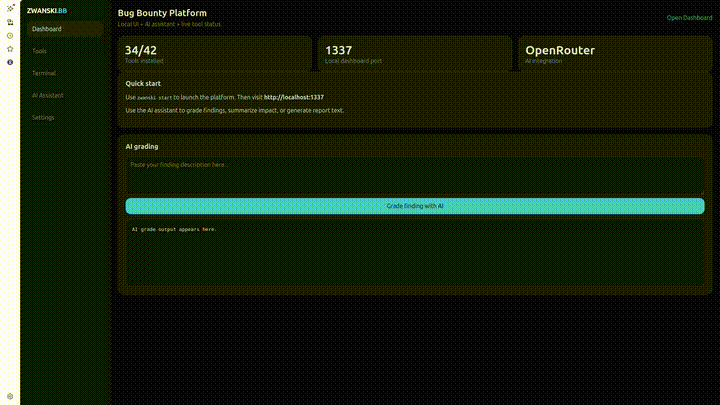

# zwanski Bug Bounty Methodology

[](https://github.com/zwanski2019/zwanski-Bug-Bounty/stargazers) [](https://github.com/zwanski2019/zwanski-Bug-Bounty/network/members) [](https://github.com/zwanski2019/zwanski-Bug-Bounty/blob/main/LICENSE)

> *By Mohamed Ibrahim (zwanski) — Bug Bounty Switzerland · HackerOne · Bugcrowd*

A practitioner-built, opinionated recon and exploitation methodology focused on **what most hunters skip**.  
Not a tool list. Not a checklist. A thinking framework backed by actual findings.

**Docs:** [In-repo wiki](docs/wiki/README.md) · [QUICKSTART.md](QUICKSTART.md) · [INSTALL.md](INSTALL.md) · [PRODUCTION.md](PRODUCTION.md) · [DOCKER.md](DOCKER.md)

---

## ZWANSKI.BB Command Center (local dashboard)

The repository includes a **Flask + Socket.IO** web UI (`ui/index.html`, `server.py`) — a single pane for tools, agents, AI, telemetry, and optional **Zwanski Watchdog** integration.

### Start

```bash
zwanski start
```

Open **http://localhost:1337** (or set `PORT` in `.env`).

### What’s in the UI

| Area | What it does |
|------|----------------|
| **Command** | War map (`/api/warmap`), scan/restart shortcuts |
| **Telemetry** | Host health + processes (`/api/system/*`) |
| **Agentic** | Multi-phase recon pipeline (`/api/agent/*`) |
| **Arsenal** | Tool registry, command preview, subdomain/OAuth chains |
| **Watchdog** | Status + allowlisted tasks for `zwanski-watchdog/` (Docker infra, `pnpm` dev servers, scanner) — [wiki](docs/wiki/watchdog.md) |
| **Terminal** | xterm unified stream + tmux-backed parallel session controls (`/api/term/sessions`) |
| **Intel AI** | Chat, grading, KB/RAG, exploit-chain hints (OpenRouter-compatible) |
| **Reports** | Report finalize API |
| **Config** | Session AI overrides; notes for `SHADOW_MODE`, `AUTO_GIT_SYNC`, and setup wizard relaunch |

### First-launch setup wizard

On first dashboard launch, ZWANSKI.BB now opens a guided setup wizard that checks required and recommended prerequisites (tools, API key, and runtime dependencies).  
Each checklist item supports **Install**, **Configure**, or **Skip**, and users can revisit the flow from **Config → Run setup wizard**.

Wizard APIs:

- `GET /api/setup/checklist`
- `POST /api/setup/decision`
- `POST /api/setup/complete`

### Watchdog environment (optional)

If you run the Watchdog stack on non-default ports, set in `.env`:

- `WATCHDOG_API_URL` (default `http://127.0.0.1:4000`)
- `WATCHDOG_WEB_URL` (default `http://127.0.0.1:3000`)
- `WATCHDOG_CLASSIFIER_URL` (default `http://127.0.0.1:8001`)

Full API table: [docs/wiki/api.md](docs/wiki/api.md).

---

## Features

- Opinionated bug bounty methodology for modern web, API, OAuth/OIDC and mobile targets
- **Command center** with War map, unified terminal, system telemetry, and agent pipelines
- **Zwanski Watchdog** tab: probe API/web/classifier and start documented infra & dev commands (no arbitrary shell)
- Local **KB / RAG** hooks and AI-assisted grading, chains, and report flow
- **OpenClaw bridge** manifest (`openclaw_bridge.json`, `GET /api/openclaw/commands`) for mobile C2 alignment
- One-command installer with optional Go toolchain helpers (`install.sh`, `setup-tools.sh`)
- **Shadow mode** (`SHADOW_MODE=1`) for jittered HTTP client behavior on in-pipeline probes
- Clean phase-based workflow from profiling to reporting (`00-setup/` … `08-reporting/`)

---

## Methodology Overview

The methodology is designed as a chain: business logic, recon, auth surface, vulnerability class, environment bleed, mobile/API correlation, and reporting. Each phase builds on the previous one so you keep scope, context, and impact front and center.

---

## Why This Is Different

Most public methodologies stop at:  
`subfinder → httpx → nuclei → ???`

This one starts where others end:
- **Business logic before technology** — understand revenue flows and data trust before running a single tool
- **Trust boundary mapping** — find where auth decisions actually happen, not where docs say they happen
- **Second-order chains** — input → stored → async-processed → output is where real criticals live
- **Environment bleed** — staging/UAT/dev environments are a goldmine that most hunters ignore entirely
- **OAuth/OIDC rogue-client chains** — the CVSS 9+ class almost nobody reports correctly
- **AI/LLM attack surface** — a largely unclaimed space in 2025-2026 programs
- **Supply chain recon** — package leaks, GitHub Actions secrets, dependency confusion

---

## Structure

```
00-setup/               → Toolchain, environment, API keys
01-target-profiling/    → Business model, scope analysis, threat model BEFORE tools
02-passive-recon/       → OSINT, GitHub dorking, historical, supply chain
03-active-recon/        → Subdomain enum, port scan, tech fingerprint, API discovery
04-auth-surface/        → OAuth/OIDC mapping, session analysis, MFA bypass vectors
05-vuln-classes/        → Business logic, race conditions, second-order, tenant isolation,
                          GraphQL, WebSockets, AI/LLM surface
06-environment-bleed/   → Staging-prod correlation, CI/CD exposure
07-mobile-api/          → APK/IPA recon, endpoint correlation with web surface
08-reporting/           → Report templates, CVSS guidance, chain documentation
scripts/                → Automation: scope parser, subdomain chain, auth flow mapper
zwanski-watchdog/       → Optional leak-pipeline monorepo (scanner, API, web, classifier)
docs/wiki/              → In-repo wiki (dashboard, API, Watchdog, configuration)
```

---

## Phase Flow

```
TARGET ASSIGNED
      │
      ▼
[01] Profiling ──► Understand the business. What data is valuable? Who are the user tiers?
      │             What's the revenue model? What would embarrass them?
      ▼
[02] Passive ────► No packets to target. OSINT, GitHub, historical, supply chain.
      │
      ▼
[03] Active ─────► Subdomain enum → live hosts → tech stack → API discovery → JS analysis
      │
      ▼
[04] Auth Surface ► OAuth flows, SSO chains, session lifecycle, privilege boundaries
      │
      ▼
[05] Vuln Classes ► Target-specific: pick the classes that match the stack
      │
      ▼
[06] Env Bleed ──► Staging/dev/UAT correlation. Often skipped. Often critical.
      │
      ▼
[07] Mobile/API ─► Cross-reference mobile endpoints with web surface
      │
      ▼
[08] Report ─────► Chain findings, calculate real business impact, draft write-up
```

---

## The Mindset

**1. Assume the perimeter is hardened. Attack the logic.**  
The WAF will catch your `<script>`. The rate limiter will catch your brute force.  
What it won't catch is you abusing a discount code endpoint to apply 100 promo codes to one order.

**2. Find the seams, not the features.**  
Bugs live at integration points: where service A trusts service B's output, where the mobile API and web API share a backend but have different validation layers, where the admin panel was built by a different team.

**3. The "assumed breach" mindset.**  
Start every target by asking: *what can a free-tier / unauthenticated user reach that they shouldn't?*  
Then: *what can a paid-tier user reach that belongs to another tenant?*

**4. Second-order everything.**  
You submitted a payload and nothing happened? Good. Come back tomorrow after the async job processes it. Check the email you receive. Check what gets rendered in the admin panel. Check the PDF export.

**5. The environment is part of the attack surface.**  
`staging.target.com`, `api-dev.target.com`, `uat-portal.target.com` — these are in scope if the root domain is in scope (verify the program's policy). They often run older code, debug flags enabled, and weaker auth.

---

## ⚡ Quick Start (One Command)

### Copy & Paste — Everything Automated

Just like Ollama, install and start using in one command:

```bash
bash <(curl -fsSL https://raw.githubusercontent.com/zwanski2019/zwanski-Bug-Bounty/main/install.sh)
```

That's it! The script will:
1. ✅ Clone the repository (or update if exists)
2. ✅ Create isolated Python environment
3. ✅ Install all dependencies (`pip install -r requirements.txt`, optional Go tools via `setup-tools.sh`)
4. ✅ Create convenient wrappers (including `PATH` prep for `$(go env GOPATH)/bin` where applicable)
5. ✅ You're ready to use immediately

### Or Run Locally

```bash
# Download installer
curl -fsSL https://raw.githubusercontent.com/zwanski2019/zwanski-Bug-Bounty/main/install.sh -o install.sh

# Run it
bash install.sh
```

### After Installation

Start using the tools immediately:

```bash
# OAuth/OIDC testing (interactive menu)
./oauth-mapper

# Or with a target
./oauth-mapper --target https://api.example.com

# Subdomain reconnaissance
./subdomain-recon example.com
```

Launcher update controls:

```bash
zwanski autoupdate on      # enable update check on start
zwanski autoupdate status  # show current auto-update state
zwanski update             # run one manual update check/pull now
```

### Full Documentation

- **[docs/wiki/](docs/wiki/README.md)** — Dashboard, Watchdog, HTTP API, configuration
- **[QUICKSTART.md](QUICKSTART.md)** — 2-minute guide
- **[INSTALL.md](INSTALL.md)** — Detailed setup & troubleshooting  
- **[PRODUCTION.md](PRODUCTION.md)** — Full production deployment
- **[DOCKER.md](DOCKER.md)** — Container-based setup
- **[zwanski-watchdog/README.md](zwanski-watchdog/README.md)** — Watchdog monorepo quick start

You can **mirror** `docs/wiki/` into [GitHub Wiki](https://docs.github.com/en/communities/documenting-your-project-with-wikis/about-wikis) if you prefer the Wiki tab; the source of truth stays in git here.

One-command sync:

```bash
bash scripts/sync-github-wiki.sh
```

Optional explicit repo slug:

```bash
bash scripts/sync-github-wiki.sh --repo zwanski2019/zwanski-Bug-Bounty
```

---

## 📸 Demo / Proof of Concept



A short walkthrough of the local ZWANSKI dashboard and AI-assisted workflow, including tool status, terminal execution, and findings grading.

### Video demo

[](https://youtu.be/IYesLdJFj7o)

**[Watch on YouTube →](https://youtu.be/IYesLdJFj7o)**

---

## 🏥 Health & telemetry

### CLI

```bash
zwanski health
```

### HTTP

Aggregated tool / integration health:

```bash
curl http://localhost:1337/api/health
```

Host-oriented metrics and process list (used by the Telemetry tab fallback):

```bash
curl http://localhost:1337/api/system/health
curl http://localhost:1337/api/system/processes
```

Typical `/api/health` payload includes status for integrations such as **Subdominator**, **NeuroSploit**, **CrawlAI-RAG**, and **OpenClaw** (Telegram/WhatsApp/Discord), depending on your `.env`.

---

## 🤖 Agentic Recon Workflow

The platform supports fully automated reconnaissance pipelines using AI agents:

### Start Agent Pipeline
```bash
curl -X POST http://localhost:1337/api/agent/run \
  -H "Content-Type: application/json" \
  -d '{"target": "example.com"}'
```

### Check Pipeline Status
```bash
curl http://localhost:1337/api/agent/<pipeline_id>
```

### Pipeline Phases
1. **Intelligence** - CrawlAI-RAG extracts target intelligence
2. **Recon** - Subdominator + ProjectDiscovery for subdomain enumeration
3. **Attack** - NeuroSploit for vulnerability detection
4. **Report** - AI-generated vulnerability reports

### Pipeline Status
```bash
# List all active pipelines
curl http://localhost:1337/api/agent

# Get specific pipeline
curl http://localhost:1337/api/agent/<pipeline_id>
```

### Auto-Reporting
```bash
curl -X POST http://localhost:1337/api/report/finalize \
  -H "Content-Type: application/json" \
  -d '{"pipeline_id": "<id>", "target": "example.com", "platform": "HackerOne"}'
```

---

## 📱 Mobile C2 (OpenClaw)

Control your recon operations from Telegram, WhatsApp, or Discord.

### Setup

1. **Install OpenClaw:**
   ```bash
   git clone https://github.com/openclaw/openclaw ~/.zwanski-bb/OpenClaw
   ```

2. **Configure Telegram Bot:**
   ```bash
   # Set environment variables
   export TELEGRAM_BOT_TOKEN="your-bot-token"
   export TELEGRAM_CHAT_ID="your-chat-id"
   ```

3. **Configure WhatsApp:**
   ```bash
   export WHATSAPP_SESSION_PATH="/path/to/session.json"
   ```

4. **Configure Discord:**
   ```bash
   export DISCORD_BOT_TOKEN="your-bot-token"
   export DISCORD_CHANNEL_ID="channel-id"
   ```

### Mobile Commands

| Command | Description |
|---------|-------------|
| `/start` | Get system status and available commands |
| `/status` | Check integrated tools health |
| `/recon <target>` | Start subdomain reconnaissance |
| `/run <tool> <args>` | Execute a security tool |
| `/scan <target>` | Run full agentic pipeline |
| `/health` | Show tools and system health |
| `/report` | Generate findings report |
| `/help` | Show all available commands |

### Example Telegram Usage
```
/start - Get welcome message with system status
/recon example.com - Start recon on target
/run subfinder -d example.com - Direct tool execution
/health - Check all tools status
```

### Secure Configuration

Create `~/.zwanski-bb/OpenClaw/secure_config.json`:
```json
{
  "approval_required": true,
  "auto_recon": true,
  "exploit_commands": ["neurosploit", "sqlmap", "nuclei"],
  "safe_commands": ["subfinder", "httpx", "crawlai-rag"],
  "github_auto_sync": true,
  "heartbeat_interval_minutes": 30
}
```

### Heartbeat Auto-Recon

Enable periodic reconnaissance on configured targets:
```bash
# In your Telegram bot, send:
/heartbeat enable example.com
/heartbeat disable
```

---

## ⚙️ Production Deployment

### Quick Start (Production)
```bash
zwanski start --prod
```

This launches Gunicorn with:
- 4 worker processes
- Eventlet async workers for WebSocket support
- 120-second timeout
- Access/error logging to stdout

### Environment Variables

Copy `.env.example` to `.env` and configure:

```bash
cp .env.example .env
# Edit .env with your API keys
```

### Required Variables
- `OPENROUTER_API_KEY` - Your OpenRouter API key

### Optional Variables
- `TELEGRAM_BOT_TOKEN` - Telegram bot for Mobile C2
- `TELEGRAM_CHAT_ID` - Your Telegram chat ID
- `GITHUB_TOKEN` - GitHub token for auto-sync
- `PORT` - Server port (default: 1337)
- `WATCHDOG_API_URL`, `WATCHDOG_WEB_URL`, `WATCHDOG_CLASSIFIER_URL` - Watchdog integration probes
- `SHADOW_MODE` - Set `1` for ghost HTTP client behavior on pipeline probes
- `AUTO_GIT_SYNC` - Set `1` only on trusted private forks

---

## Maintained by

**Mohamed Ibrahim** — [`zwanski`](https://github.com/zwanski2019)  
[zwanski.bio](https://zwanski.bio) · Bug Bounty Switzerland · HackerOne · Bugcrowd

---

*PRs welcome. If you found a critical using this methodology, open an issue and share (redacted) — I'll add it to the case studies.*
